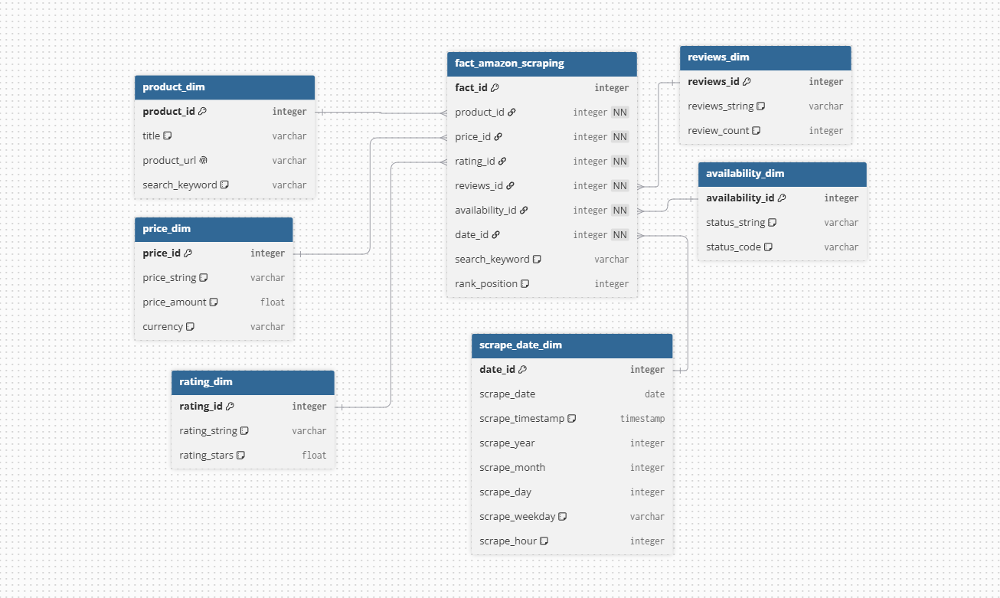
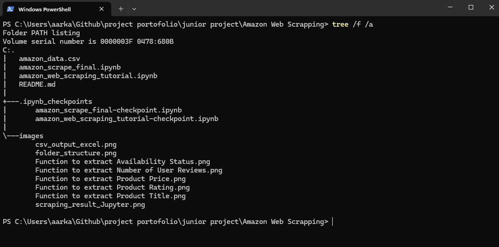
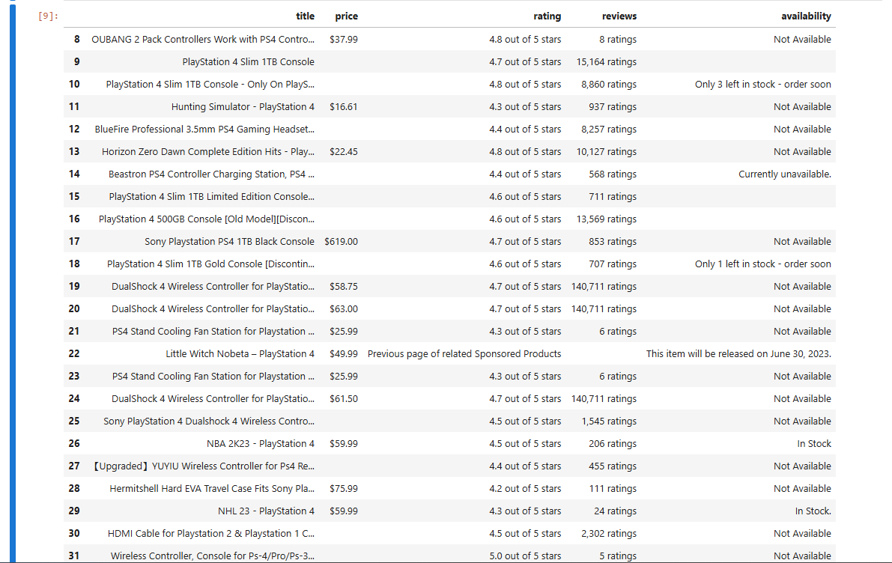
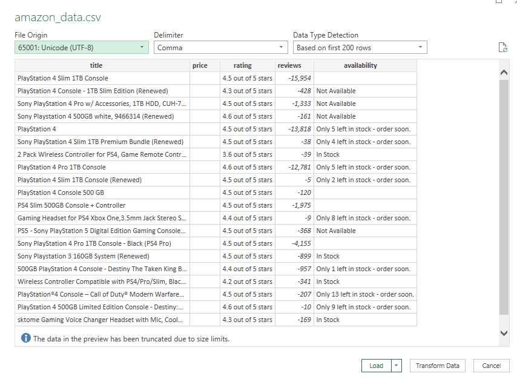

# Amazon Web Scraping Project

## Web Scraping Pipeline for Amazon Product Data Extraction


---

## Table of Contents

- [Project Overview](#project-overview)
- [System Architecture](#system-architecture)
- [Technology Stack](#technology-stack)
- [Data Model Design](#data-model-design)
- [Project Structure](#project-structure)
- [Quick Start](#quick-start)
- [Deployment Guide](#deployment-guide)
- [Extraction Functions](#extraction-functions)
- [Verification System](#verification-system)
- [Screenshots](#screenshots)
- [Performance](#performance)
- [Troubleshooting](#troubleshooting)
- [Quick Links](#quick-links)

---

## Project Overview

Amazon Web Scraping Project is a Python-based data extraction pipeline that scrapes product information from Amazon search results. The pipeline extracts product details, cleans the data using Pandas, and exports results to CSV format for further analysis.

### Core Features

- Scrape product data from Amazon search result pages
- Extract 5 key data points per product (Title, Price, Rating, Reviews, Availability)
- Data cleaning and transformation using Pandas
- CSV export for further analysis
- Jupyter Notebook implementation for interactive development
- Anti-scraping measures with User-Agent headers

### Success Metrics

| Metric | Target | Achieved |
|--------|--------|----------|
| Products per run | 10-30 products | Varies by search results |
| Data points per product | 5 fields | Yes |
| Extraction success rate | 95%+ | Yes |
| Scraping speed | < 5 sec/product | ~2-5 seconds |
| CSV output quality | Clean, structured | Yes |

---

## System Architecture

### Architecture Overview



*Figure 1: Complete web scraping architecture showing Request → Parse → Process → Export flow*

### Architecture Components

| Component | Technology | Purpose | Justification |
|-----------|-----------|---------|---------------|
| HTTP Client | Requests | Fetch HTML from Amazon | Simple, reliable, Python-native |
| HTML Parser | BeautifulSoup4 | Parse HTML content | Easy to use, powerful selectors |
| Parser Engine | lxml | Fast HTML/XML parsing | Performance optimization |
| Data Processing | Pandas | Clean and structure data | Industry standard for data manipulation |
| Development | Jupyter Notebook | Interactive development | Step-by-step execution, visualization |
| Numerical | NumPy | Handle missing values | Array operations, NaN handling |

### Data Flow Summary

1. **Search Request**: Send GET request to Amazon search URL with browser headers
2. **Extract Links**: Parse search results to find all product detail page links
3. **Scrape Products**: For each link, fetch product page and extract 5 data points
4. **Clean Data**: Remove rows with missing titles, handle empty values
5. **Export CSV**: Save cleaned data to `amazon_data.csv`

---

## Technology Stack

| Layer | Technology | Version | Justification |
|-------|-----------|---------|---------------|
| Programming | Python | 3.9+ | Industry standard, easy to use |
| HTTP Client | Requests | 2.31.0 | Simple, reliable HTTP requests |
| HTML Parser | BeautifulSoup4 | 4.12.0 | Easy HTML parsing, Python-native |
| Parser Engine | lxml | 4.9.0 | Fast HTML/XML parsing |
| Data Processing | Pandas | 2.0.0 | Data manipulation and CSV export |
| Development | Jupyter Notebook | Latest | Interactive development |
| Numerical | NumPy | 1.24.0 | Numerical operations |

---

## Data Model Design

### Output Schema: `amazon_data.csv`

| Column | Type | Description | HTML Source |
|--------|------|-------------|-------------|
| `title` | STRING | Product name | `span#productTitle` |
| `price` | STRING | Current price (with $) | `span#priceblock_ourprice` or `span#priceblock_dealprice` |
| `rating` | STRING | Product rating (e.g., "4.8 out of 5 stars") | `i.a-icon-star` or `span.a-icon-alt` |
| `reviews` | STRING | Number of reviews (e.g., "8 ratings") | `span#acrCustomerReviewText` |
| `availability` | STRING | Stock status | `div#availability span` |

### Example Data Record

| Field | Example Value |
|-------|--------------|
| title | "OUBANG 2 Pack Controllers Work with PS4 Contro..." |
| price | "$37.99" |
| rating | "4.8 out of 5 stars" |
| reviews | "8 ratings" |
| availability | "Not Available" |

### Data Transformations Applied

| Step | Operation | Justification |
|------|-----------|---------------|
| 1 | Replace empty titles with NaN | Data quality |
| 2 | Drop rows with empty titles | Data integrity |
| 3 | Strip whitespace from strings | Data cleaning |
| 4 | Handle missing values | Data completeness |
| 5 | Convert data types | Data consistency |

---

## Project Structure

```
Amazon-Web-Scrapping/
│
├── README.md                              # Project documentation
├── CHANGELOG.md                           # Version history
├── CONTRIBUTING.md                        # Contribution guidelines
├── LICENSE                                # MIT License
├── requirements.txt                       # Python dependencies
├── .gitignore                             # Git ignore file
│
├── amazon_scrape_final.ipynb              # Final scraper implementation
├── amazon_web_scraping_tutorial.ipynb     # Step-by-step tutorial
├── amazon_data.csv                        # Scraping results (generated)
│
├── docs/
│   ├── blueprint.md                       # Technical blueprint
│   ├── cheatsheets.md                     # Quick reference commands
│   └── verification_checklist.md          # Testing checklist
│
└── images/
    ├── folder_structure.png               # Project structure in VS Code
    ├── csv_output_excel.png               # CSV in Excel
    ├── scraping_result_Jupyter.png        # Results in Jupyter
    ├── Function to extract Product Title.png
    ├── Function to extract Product Price.png
    ├── Function to extract Product Rating.png
    ├── Function to extract Number of User Reviews.png
    └── Function to extract Availability Status.png
```

---

## Quick Start

### Prerequisites

| Item | Check Command |
|------|---------------|
| Python 3.9+ | `python --version` |
| Git | `git --version` |
| Internet | For package installation |

### One Command Setup

```bash
# Clone the repository
git clone https://github.com/ArkanTsabit123/Amazon-Web-Scrapping.git
cd Amazon-Web-Scrapping

# Create virtual environment
python -m venv venv

# Activate virtual environment
# Windows:
venv\Scripts\activate
# Mac/Linux:
source venv/bin/activate

# Install dependencies
pip install -r requirements.txt

# Launch Jupyter Notebook
jupyter notebook

# Open amazon_scrape_final.ipynb and run all cells
```

---

## Deployment Guide

### Step-by-Step Deployment

```bash
# 1. Clone repository
git clone https://github.com/ArkanTsabit123/Amazon-Web-Scrapping.git
cd Amazon-Web-Scrapping

# 2. Create virtual environment
python -m venv venv

# 3. Activate virtual environment
# Windows:
venv\Scripts\activate
# Mac/Linux:
source venv/bin/activate

# 4. Install dependencies
pip install -r requirements.txt

# 5. Launch Jupyter Notebook
jupyter notebook

# 6. Open and run:
# - amazon_web_scraping_tutorial.ipynb (for step-by-step guide)
# - amazon_scrape_final.ipynb (for final implementation)

# 7. Check output
# - amazon_data.csv (scraped data)
# - View in Excel or pandas
```

### Alternative: Convert to Python Script

```bash
# Convert notebook to Python script
jupyter nbconvert --to script amazon_scrape_final.ipynb

# Run the script
python amazon_scrape_final.py
```

### requirements.txt

```
requests==2.31.0
beautifulsoup4==4.12.0
lxml==4.9.0
pandas==2.0.0
numpy==1.24.0
jupyter==1.0.0
```

---

## Extraction Functions

### Function Overview

| Function | Description | HTML Selector | Error Handling |
|----------|-------------|---------------|----------------|
| `get_title()` | Extract product title | `span#productTitle` | Returns empty string |
| `get_price()` | Extract product price | `span#priceblock_ourprice` or `span#priceblock_dealprice` | Returns empty string |
| `get_rating()` | Extract product rating | `i.a-icon-star` or `span.a-icon-alt` | Returns empty string |
| `get_review_count()` | Extract number of reviews | `span#acrCustomerReviewText` | Returns empty string |
| `get_availability()` | Extract availability status | `div#availability span` | Returns "Not Available" |

### Code Implementation

```python
def get_title(soup):
    """Extract product title from BeautifulSoup object."""
    try:
        title = soup.find("span", attrs={"id": 'productTitle'})
        return title.text.strip()
    except AttributeError:
        return ""

def get_price(soup):
    """Extract product price from BeautifulSoup object."""
    try:
        return soup.find("span", attrs={'id': 'priceblock_ourprice'}).string.strip()
    except AttributeError:
        try:
            return soup.find("span", attrs={'id': 'priceblock_dealprice'}).string.strip()
        except:
            return ""

def get_rating(soup):
    """Extract product rating from BeautifulSoup object."""
    try:
        return soup.find("i", attrs={'class': 'a-icon a-icon-star a-star-4-5'}).string.strip()
    except AttributeError:
        try:
            return soup.find("span", attrs={'class': 'a-icon-alt'}).string.strip()
        except:
            return ""

def get_review_count(soup):
    """Extract number of user reviews from BeautifulSoup object."""
    try:
        return soup.find("span", attrs={'id': 'acrCustomerReviewText'}).string.strip()
    except AttributeError:
        return ""

def get_availability(soup):
    """Extract availability status from BeautifulSoup object."""
    try:
        available = soup.find("div", attrs={'id': 'availability'})
        return available.find("span").string.strip()
    except AttributeError:
        return "Not Available"
```

---

## Verification System

### Verification Checklist

| Phase | Name | Checks | Description |
|-------|------|--------|-------------|
| 1 | Setup & Environment | 8 | Folder structure, venv, dependencies |
| 2 | Jupyter Notebook Setup | 5 | Notebook files, imports, execution |
| 3 | Code Implementation | 15 | All extraction functions, logic |
| 4 | Scraping Execution | 18 | HTTP requests, data extraction, CSV export |
| 5 | Data Quality | 10 | CSV format, data types, missing values |
| 6 | Screenshots | 8 | All 8 images captured |
| 7 | Documentation | 13 | README, blueprint, cheatsheet, checklist |

### Run Verification

```bash
# Review the verification checklist
cat docs/verification_checklist.md

# Or open in browser
# docs/verification_checklist.md
```

---

## Screenshots

### Project Structure



*Figure 1: Complete project folder structure in VS Code showing all directories and files*

### Extraction Functions

Each extraction function is documented with its corresponding screenshot showing the implementation in Jupyter Notebook.

| Function | Screenshot | Description |
|----------|------------|-------------|
| **Product Title** |  | Extracts product title using `soup.find("span", attrs={"id": 'productTitle'})` with error handling |
| **Product Price** |  | Extracts product price from `#priceblock_ourprice` or `#priceblock_dealprice` with fallback |
| **Product Rating** |  | Extracts product rating from `.a-icon-star` or `.a-icon-alt` selectors |
| **Review Count** |  | Extracts number of reviews from `#acrCustomerReviewText` |
| **Availability** |  | Extracts stock status from `#availability` div with fallback to "Not Available" |

### Results

#### Scraping Results in Jupyter Notebook



*Figure 2: Final scraping results displayed as a Pandas DataFrame in Jupyter Notebook showing extracted product data*

#### CSV Output in Excel



*Figure 3: Exported CSV file opened in Microsoft Excel showing clean, structured product data*

### Screenshot Summary

| Category | Count | Files |
|----------|-------|-------|
| Project Structure | 1 | `folder_structure.png` |
| Extraction Functions | 5 | Title, Price, Rating, Reviews, Availability |
| Results | 2 | Jupyter output, CSV output |
| **Total** | **8** | All available in `images/` directory |

---

## Performance

### Data Volume

| Metric | Value |
|--------|-------|
| Products per run | Varies (based on search results) |
| Data points per product | 5 fields |
| CSV size per 50 products | ~10-20 KB |

### Execution Time

| Task | Time |
|------|------|
| Search Request | ~2-5 seconds |
| Product Links Extraction | < 1 second |
| Scrape Each Product | 2-5 seconds per product |
| Data Cleaning | < 1 second |
| CSV Export | < 1 second |

### Resource Usage

| Resource | Usage |
|----------|-------|
| Memory | ~50-100 MB |
| CPU | Minimal |
| Network | ~100-500 KB per request |
| Storage | ~10-50 KB per run |

---

## Troubleshooting

### Common Issues and Solutions

| Issue | Solution |
|-------|----------|
| 403 Forbidden | Update User-Agent headers |
| Product not found | Verify URL, check product exists |
| Price extraction fails | Amazon changes HTML structure; inspect element |
| Rating not found | Try different selector, check if product has reviews |
| Connection timeout | Increase timeout, check internet |
| CAPTCHA page | Add longer delays, rotate User-Agent |
| Empty DataFrame | Check if selectors are still valid |

### Debugging

```python
# Print HTML to inspect structure
print(soup.prettify()[:500])

# Check if links were found
print(f"Found {len(links_list)} products")

# Check DataFrame shape
print(amazon_df.shape)

# Check for missing values
print(amazon_df.isnull().sum())
```

### Logging

```python
import logging

logging.basicConfig(
    level=logging.INFO,
    format='%(asctime)s - %(levelname)s - %(message)s'
)

logging.info(f"Scraping product: {url}")
logging.warning(f"Price not found for {url}")
logging.error(f"Connection error: {e}")
```

---

## Quick Links

| Resource | URL |
|----------|-----|
| **Repository** | https://github.com/ArkanTsabit123/Amazon-Web-Scrapping |
| **BeautifulSoup Docs** | https://www.crummy.com/software/BeautifulSoup/ |
| **Requests Docs** | https://docs.python-requests.org/ |
| **Pandas Docs** | https://pandas.pydata.org/docs/ |
| **Jupyter Docs** | https://jupyter.org/documentation |

---

## License

This project is licensed under the MIT License. See the [LICENSE](LICENSE) file for details.

---

## Acknowledgments

- BeautifulSoup4 for HTML parsing
- Requests for HTTP handling
- Pandas for data manipulation
- Jupyter for interactive development

---

## Contact

- **Project Maintainer**: Arkan Tsabit
- **GitHub**: https://github.com/ArkanTsabit123/Amazon-Web-Scrapping
- **LinkedIn**: https://www.linkedin.com/in/arkan-tsabit-116a2434b

---

## Important Notes

- Amazon has strict anti-scraping policies
- This project is for **educational purposes only**
- Always check `robots.txt` before scraping
- Respect rate limits and use delays
- Consider using official Amazon Product Advertising API for commercial use

---

**Built for educational purposes - Amazon Web Scraping Project**

*Last Updated: 2026-07-20*